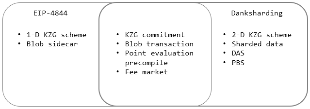
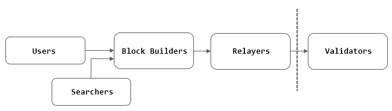

## 이더리움 토막상식(2-1)

1. 비콘체인 balancing attack  
지분증명 블록체인을 공격하는 방식은 여러 형태가 있다. 비트코인 같은 작업증명의 경우 이론적으로 해시파워 51%를 가지면 네트워크를 장악할 수 있다고 말하는 것처럼 지분증명도 대략 66% 이상의 지분을 확보하면 된다. 현재(2023년 9월) 약 2600만 이더가 참여하고 있고 66%는 270억 달러 정도의 이더를 확보해야 한다는 계산이 나오는데 현실적이지는 않다. 또는 33% 이상을 확보하면 데이터의 합의를 방해할 수도 있다.  

   큰 지분을 확보하지 않더라도 확률적으로 가능한 공격 방식이 있는데 그 중에 하나가 "balancing attack" 이다. 이 방법은 억지스러운 면이 있어서 크게 신경쓰지 않아도 된다고 생각하는 사람들이 있는 반면 현실적으로 가능하다고 보는 쪽도 있다. 이더리움 재단의 입장은 후자에 속한다. 아래 블로그를 참조.  
   [Finalized no. 31](https://blog.ethereum.org/2021/11/02/finalized-no-31)  
이 공격은 의도적으로 분기 상황을 짧은 시간 동안 유지하게 만들어서 블록체인이 reorg 상황에 놓이도록 하는 공격 방식이다(short-range reorg). 프로토콜 위반도 아니고 또 이를 시도하는 공격자가 얻는 이익이 명확하지 않지만 분기가 지속된다는 것은 대다수가 합의하는 단일한 마스터 원장을 추구하는 블록체인에서는 바람직하지 않다.  

   우선 공격자는 연속적으로 인접한 슬롯에서 블록 생성자로 선택되어야 한다. 블록 생성자는 슈도랜덤이지만 단일 주체가 운영하는 검증노드가 연속적인 슬롯에 배치되는 것이 불가능하지는 않다. 또 1 epoch 전에 검증자들이 슬롯에 스케줄링되므로 블록 생성자들을 미리 알 수 있다.  
다음은 각 슬롯에 공격자가 컨트롤 가능한 검증자들이 어느정도 분포되어 있어서 attestation을 제어할 수 있어야 한다. "balancing attack"이라는 이름에서 유추해볼 수 있는 것처럼 
연속으로 배치된 슬롯에서 분기를 형성한 다음 이후 분기 블록에 대해 다른 정상 검증자들의 attestation 상황을 보면서 각 분기 블록의 attestation을 balancing하여 "tie"를 이루도록 하는 것이다(어려운 용어로 "Ex post reorg"라고 한다). 공격자는 자신이 제어 가능한 attestation 메시지들을 적당한 시간에 전파해서 정상 검증자들 중 대략 50%에게 LMD-GHOST 투표에 영향을 줄 수 있다.  
자세한 내용은 아래 문서를 참조할 것.  
[Three Attacks on Proof-of-Stake Ethereum](https://arxiv.org/abs/2110.10086)


2. Proposer boost  
앞서 balancing attack은 LMD-GHOST가 검증자들의 최근 attestation만을 고려하는 특성을 이용한 것으로 검증 노드의 일정한 비율을 확보한 공격자가 자신의 attestation을 re-balancing하여 tie 상태를 의도적으로 지속하는 것이었다.  
비콘 노드 클라이언트 개발팀들은 이러한 공격에 대응하기 위해 "Proposer boost"라는 기능을 추가했다. 단지 최근 메시지만을 고려하는 것이 아니라 블록 생성자 즉 Proposer가 제 시간에 블록을 생성한 경우 아직 그 블록에 대한 attestation이 확보되기 전에 "boost"해서 최근 블록으로 판단한다는 것이다. 이렇게 하면 설령 공격자가 상황에 따라 자신들의 attestation을 제어하더라도 정상적인 블록 생성자의 블록으로 canonical 체인을 형성할 수 있다.  


3. 비콘체인의 7-block reorg "사건(incident)"  
2022년 5월 22일 비콘체인에서 연속 7개 슬롯에서 생성된 블록이 전부 reorg 되는 사건이 발생했다. 이것을 "사건"으로 규정한 것은 "hacking"이나 보안취약점으로 인한 "exploit"이 아니기 때문이다.  
프리즘 개발자인 테렌스의 트윗을 인용해보자.  
[7-block reorg](https://twitter.com/terencechain/status/1529566839033933824)  
Proposer boost는 비콘체인 클라이언트의 추가 기능이었기 때문에 클라이언트를 개발하는 여러 팀들은 수정된 버전의 배포 시점이 모두 상이했다. 당시 클라이언트 사용 비율이 높았던 프리즘이 가장 먼저 Proposer boost 버전을 배포했다.  
프리즘 외에 다른 클라이언트를 사용하는 검증 노드들은 여전히 LMD-GHOST를 기준으로 최근 블록을 판단했기 때문에 블록을 바라보는 view가 달랐고 이로 인해 "boost"된 7개의 블록들이 진행되다가 결국 8번째는 LMD인 블록을 최근 블록으로 판단하면서 이전에 만들어진 7개의 블록들이 reorg되고 말았다.  
이 사건은 긍정적으로 보자면 이더리움이 프로토콜 대로 동작하고 있다는 것을 증명한 것이지만, 반대로 보면 개별적으로 구현된 클라이언트들의 불일치로 인해 장시간 reorg가 발생할 수 있음을 보여주었다.  


4. 지분증명 전환 후 geth만으로 동기화 가능?  
현재는 불가능하다. geth와 같은 실행계층 클라이언트는 더이상 블록을 가십(gossiping)하지 않으므로 체인 자체가 형성되지 않는다. 다만 트랜잭션들은 이전처럼 전파되고 공유된다. 논리적으로는 비콘체인의 블록에 실행블록이 payload 형태로 포함되어 있는 구조이다.  


5. 유효잔액(Effective Balance)  
유효잔액은 프로토콜에서 필요한 여러 값을 계산하는데 사용되는 상수에 해당한다. 일반적인 잔액은 보상이 쌓이면서 계속 변하는데(물론 32Ξ 이상이면 인출이 되지만 인출 설정을 하지 않은 계정도 있을 수 있다) 많은 잔액을 보유한 검증자들에게 쏠림 현상이 나타나지 않도록 일종의 평등한 기회를 주기 위한 성격이 있다.  
검증자의 유효잔액은 최대 32개를 넘을 수 없고(MAX_EFFECTIVE_BALANCE=32) 소수점이 나올 수 없다. 현재 잔액이 +1.25Ξ 늘어나면 유효잔액은 +1 늘어난다. 현재 잔액이 -0.25Ξ 감소하면 유효잔액은 -1 감소한다.  
앞서 말한 것처럼 유효잔액은 해당 검증자의 보상을 계산할 때 사용되고 또 블록 생성자를 선택할 때 활용된다. 또 66% 이상의 합의는 전체 유효잔액의 66%를 의미하기 때문에 검증자의 유효잔액이 낮으면 그에 비례하여 attestation weight도 작아진다고 말할 수 있다. 만약 검증노드를 오랜 시간동안 운영하지 않아 유효잔액이 16Ξ까지 떨어지면 검증자 풀에서 자동으로 제외된다. 


6. 블록 생성자 선택 확률  
모든 노드들이 동일한 검증자를 해당 슬롯에서 블록 생성자로 계산해야 하므로 슈도랜덤하게 선택한다. 비콘체인은 현재 RANDAO라는 방식으로 난수를 계산하여 블록 생성자 번호를 선택한다. 지분증명 전환 후에 RANDAO 값은 실행블록의 `mixHash` 항목에 기록되고 있다.  
그런데 블록 생성자 선택 확률은 유효잔액의 영향을 받는다.  
   ```
   if effective_balance * MAX_RANDOM_BYTE >= MAX_EFFECTIVE_BALANCE * random_byte:
      return candidate_index
   ```
   위와 같은 로직이 적용되어 있기 때문에 슈도랜덤이라고 해도 검증자의 유효잔액 `effective_balance`이 작으면 선택될 확률이 상대적으로 줄어든다. 결과적으로 정상적으로 성실하게 검증 노드를 운영하면 유효잔액은 항상 32를 유지하게 될 것이고 그렇게 되면 슈도랜덤하게 선택되기만 기대하면 된다.  


7. 최대 유효잔액을 늘리자는 제안(EIP-7251)  
현재 32로 고정된 최대 유효잔액(MAX_EFFECTIVE_BALANCE)을 늘려야 한다는 제안. 이유는 검증자 수가 계속 증가 추세에 있고 이것은 합의계층에서 주고 받는 메시지가 늘어나서 네트워크와 처리용량의 부하가 커질 가능성이 많기 때문이다. 과거 실행계층의 상태 트리가 커지는 것이 문제였던 것처럼 검증자가 늘어나서 attestation의 수가 많아지면 처리할 데이터들도 그만큼 늘어나게 되는 것은 당연하다.  
최대 유효잔액이 32로 고정되어 있으므로 검증 보상을 늘리기 위해서는 Lido 같은 스테이킹 풀이 수많은 검증노드를 계속 추가해서 운영할 수 밖에는 없다. 유효잔액을 늘리면 32개씩 나눌 필요가 없으므로 노드 수는 줄어들게 된다. 하지만 검증자가 되기 위한 최소 예치 수량은 여전히 32개로 변하지 않는다. EIP-7251은 유효잔액을 2048Ξ까지 늘리는 것을 제안한 상태이다. 보다 자세한 사항은 아래 링크 참조.  
[EIP-7251 FAQ](https://notes.ethereum.org/@mikeneuder/eip-7251-faq)  


8. 이더리움 성능개선 - 샤딩(Sharding)  
이더리움이 지분증명으로 전환하면서 초기에는 크게 세 단계(Phase)의 로드맵을 제시했다. Phase 0은 비콘체인, Phase 1은 샤딩, Phase 2에서는 실행계층(eWASM). 지금은 이것을 기억하는 사람이 거의 없을 것 같은데 왜냐하면 Phase 0이 진행되는 중에 로드맵이 많이 수정되었기 때문이다.  
2020년 10월 비탈릭 부테린이 제시한 소위 "[rollup-centric ethereum roadmap](https://ethereum-magicians.org/t/a-rollup-centric-ethereum-roadmap/4698)"이 가시화되면서 많은 부분에서 변화가 시작되었다.  
이더리움은 고성능 단일 L1 체인의 길을 포기하고 흔히 말하는 다계층 또는 모듈식(modular) 블록체인을 지향하고 있다. 그런 맥락에서 이더리움 샤딩 초기에는 수십 또는 수천 개의 샤드를 나누고 각 샤드별로 (병렬적으로) 트랜잭션들을 처리하는 방향으로 가는 듯 했으나 복잡하고 해결하기 어려운 문제가 많아서 결국 "롤업" 중심으로 방향을 돌리게 된다.  
현재 이더리움의 샤딩은 "Danksharding"이라고 부르며 L2의 롤업 데이터를 어떻게 나누어서 저장하고 검증할 것인가에 대한 문제에 집중하고 있다. 즉 이더리움의 샤딩은 이더리움 L1을 "Data Availability(또는 Data Publishing)" 계층으로 사용하는 데이터 샤딩이고, 사람들이 생각하는 성능개선 즉 저렴하고 빠른 트랜잭션 처리는 사실상 다양한 L2 개발팀들이 해결해야 할 숙제로 넘겨버린다. Danksharding은 그것을 제안한 [Dankrad Feist](https://twitter.com/dankrad)의 이름에서 유래한다.  
샤딩된 데이터의 저장공간을 트랜잭션이 저장되는 블록과 구별하여 "Blobspace" 라고 한다. 블롭(blob)은 일반적으로 바이너리 데이터를 통칭하는 용어이다. L2에서 발생한 많은 거래 데이터를 압축해서 전송하기 때문에 blob이라고 표현하는 것 같다.


9. proto-danksharding  
완전한 샤딩에 해당하는 Danksharding으로 가는 것은 시간이 많이 걸리는 일이기 때문에 처음에는 일부만을 구현하는 계획을 세우게 된다. 그 첫 단계가 "proto-danksharding"이다. "proto"는 옵티미즘에서 일하는 개발자 [proto.eth](https://twitter.com/protolambda)의 제안에서 유래한다. 2023년 하반기에 예정되어 있는 Deneb+Cancun 하드포크의 EIP-4844로 적용될 예정이다.  
proto-danksharding은 엄밀히 말하면 샤딩이 없는 샤딩이다. 즉 샤딩의 주요 목적 "분할해서" 롤업 데이터를 검증하는 DAS(Data Availability Sampling)는 구현하지 않는다. 완전한 샤딩을 위해 기본 기능들을 구현하거나 나중에 더 개선된 것으로 대체하기 위한 준비 단계의 성격이 크다.  
지금 L2의 롤업 데이터들은 실행블록의 calldata 형태로 저장된다. 다시 말해서 일반적인 트랜잭션과 동일하고 그래서 가스비의 부담이 크다(트랜잭션이 몰리는 경우에는 L1의 수수료보다 비싼 적도 있었다). L2의 수수료의 많은 부분이 L1에 데이터를 저장하기 위한 비용이기 때문에 이를 더 낮추면 L2의 성능개선이 획기적으로 이루어질 수 있다. 그래서 "블롭 트랜잭션"이라는 롤업 데이터 전용 트랜잭션을 별도로 만들고 "데이터 가스"를 적용하여 별도의 수수료 체계를 따르도록 한다. 당연히 현재 트랜잭션 가스비보다는 훨씬 저렴할 것으로 예상된다.  

     


10. 롤업 데이터(블롭) 저장 기간  
L2의 롤업 데이터를 탈중앙화된 L1에 저장하여 L2의 거래내역을 검증하도록 하는 것이 이더리움 샤딩의 핵심이다. 그러나 블록 데이터와 함께 롤업 데이터가 추가되면 사실상 논리적인 블록의 크기가 커지는 셈이고 그만큼 처리시간과 디스크 소모가 가속화될 수 밖에 없다.  
최근 개발자 회의(ACDC#117)에서 블록당 블롭의 개수에 대한 논의가 계속 되고 있다. 블록당 최대 6개 정도를 고려하고 있는데, 이렇게 되면 블롭 1개의 크기는 128KB이므로 대략 블록당 최대 768KB 정도가 늘어난다고 볼 수 있다. 블롭 트랜잭션은 일반 트랜잭션과 구분되고 다른 수수료가 적용된다. 아무튼 블록의 평균적인 크기를 대략 90-100KB 정도로 보는데 지금보다 6배이상 처리해야 할 데이터가 늘어나는 셈이다.  
블롭 데이터는 블록처럼 영구히 저장하지 않고 대략 2-3주(4096 epoch)가 지나면 삭제하는 것이 가능하다. 롤업 프로토콜의 특성상 L2의 거래 내역들은 일정 기간이 지나거나 암호학적으로 확정되면 되돌릴 수 없기 때문에 그대로 현재 상태를 모든 당사자들이 합의한 것으로 판단한다. 옵티미스틱 롤업의 경우는 7일의 챌린지 기간동안 아무 이의가 없으면 확정되고 ZK롤업은 아예 잘못된 거래 내역이 L1에 전송될 수 없다.  
L1에서 볼롭이 삭제되면 영원히 없어지는 것일까? 꼭 그렇게 볼 수는 없다. 제3자 Data Availability 서비스가 그 데이터를 영구히 저장할 수도 있다. 대표적으로 이더스캔이나 [The Graph](https://thegraph.com/) 프로토콜을 사용한 여러 인덱싱 서비스들이 히스토리 데이터의 저장소 역할을 할 수 있다.  


11. 롤업의 종류  
이더리움이 사실상 Phase 2에 해당하는 실행계층을 L2로 떠넘긴 상황에서 상당히 많은 L2 개발팀들이 등장했다. 현재 L2 현황은 아래 사이트에서 확인할 수 있다.  
[L2BEAT](https://l2beat.com/)  
L2에 적용되는 기술은 크게 두 가지로 분류할 수 있다.

     - 옵티미스틱 롤업
     - ZK 롤업  
  
    옵티미스틱 롤업은 말 그대로 L2의 거래가 대부분 거짓없이 처리될 것이라는 "낙관적인(optimistic)" 관점에 기반하고 있다. 다만 L2의 상태가 서로 충돌할 경우 어느 것이 맞는지 판단하기 위해 7일 정도의 챌린지 기간을 둔다. L2에서 발생한 거래 내역들은 위변조할 수 없는 L1 이더리움에 저장되어 있으므로 언제든지 꺼내서 누가 잘못 했는지 검증하고 잘못이 밝혀지면 그 검증자의 보증금(pledge)을 몰수하게 된다. 이것을 "fraud proof"라고 한다.  
    ZK 롤업은 "영지식증명(Zero-Knowledge Proof)"이라는 암호학적 이론을 이용하는 것으로 L2에서 발생하는 거래 내역들의 무결성을 "SNARK"이라고 짧은 증명으로 만들어 L1에 제출하면 L1의 컨트랙트에서 그것을 확인하는 방식이다. 따라서 옵티미스틱 롤업의 챌린지 기간 같은 것이 필요없고 거짓 거래 내역이 L1에서 통과될 가능성은 (이론적으로는) 없다. 이것을 "validity proof"라고 한다.  
    현재 메인넷에 적용되어 있는 L2들이 다수 있지만 중앙화되어 있고 단일 주체가 관리하고 있다. 하지만 L2의 탈중앙화는 반드시 필수적인 것은 아니다. 왜냐하면 L2를 검증하는 것은 L1에 저장되는 거래 내역이나 암호학적 증명이기 때문이다. 물론 L2의 거래를 처리하는 시퀀서(sequencer)들에 문제가 발생하면 L2 자체가 동작하지 않을 수 있고 L1과 L2 사이의 브리지가 해커의 공격을 받을 위험, 검열의 문제가 있을 수 있다.  
    일반적으로 ZK 롤업을 L2의 최종판 "엔드게임(endgame)"이라고 말한다. 왜냐하면 7일이라는 심사 기간을 두지 않아도 되고 아무리 거래 내역이 많아도 SNARK이라는 일정한 길이를 가지는 증명으로 검증할 수 있기 때문이다.  
    두 가지 유형의 롤업 모두 거래 내역 데이터 또는 상태전이 데이터(state delta)를 저장해놓고 있어야 하고 이것이 탈중앙화된 데이터 계층, DA 계층이 필요한 이유이다.  


12. ZK 롤업의 유형  
범용 ZK롤업을 개발하는 여러 팀들은 경쟁이 치열하고 사이가 좋지 않다. 특히 폴리곤 Hermez의 공격적인(?) 마케팅 덕분에 개발팀들은 서로 설전을 벌이기도 한다. 폴리곤은 사이드체인을 L2라고 홍보한 전력 때문에 이번에도 같은 식으로 비판을 받고 있다.  
ZK 롤업에서 가장 중요한 셀링 포인트는 기존 EVM과의 동일성(equivalence) 또는 호환성(compatibility)이다. 
많은 사람들이 바라는 것은 현재 이더리움에서 동작하는 대부분의 dapp들이 큰 어려움 없이 L2로 이행하는 것이다. 그렇게 하기 위해서는 EVM 기반으로 작성된 많은 컨트랙트들이 L2 실행환경에서 99% 그대로 동작해야 한다. 하지만 EVM과 ZK 기술은 태생적으로 융합되기 어렵다는 근본적인 한계가 있다.  
이를 해결하는 방법은 각 개발팀마다 다르고 자신들의 EVM 즉 zkEVM을 어떻게 규정할 것인가도 차이가 있다. 이런 부분 때문에 논쟁이 생기는데 폴리곤이 자신들의 zkEVM을 EVM-equivalent라고 주장하면 다른 개발팀들은 이러저런 근거로 그것이 아니라고 반박하는 식이다.  
결국 비탈릭 부테린은 [The different types of ZK-EVMs](https://vitalik.ca/general/2022/08/04/zkevm.html)에서 중재에 나서게 된다. 이 글에 의하면 그 정도에 따라 대략 4가지 유형이 있고 모두 장단점이 있다. 이 분류에서 안타까운 사실은 호환성과 성능은 반비례 관계에 있다는 것이다. 대략적으로 나누면 아래와 같다.  
    - EVM 스펙을 100% 따르는 zkEVM - Scroll
    - EVM opcode 레벨에서 호환성 유지 - 자체적으로 구현한 VM에서 실행 - Hermez
    - 자체 언어를 사용하거나 컴파일러를 제공하고 자체적으로 구현한 VM에서 실행 - StrakNet, zkSync  

    StarkNet 같은 경우는 "Cario"라는 별도의 언어가 존재하고 zkSync는 "zksolc"라는 컴파일러를 제공한다.  
옵티미스틱 롤업에서는 ZK 롤업과 같은 문제는 발생하지 않는다. 단순히 거래내역을 저장하면 되기 때문에 L2 실행환경에서 EVM을 그대로 사용할 수 있다(초기에는 옵티미즘이 OVM, 아비트럼이 AVM을 가지고 있었지만 지금은 모두 EVM 100% 동일성을 보장하고 있다).  
비탈릭 부테린이 말한 것처럼, zkEVM의 표준이 필요한 것도 아니고 이더리움에서 어느 것 하나를 선택해야 하는 상황은 더더욱 아니기 때문에 ZK 기술이 적용된 다양한 실행환경이 제공되는 것은 바람직한 일이라고 할 수 있다.


13. "in-protocol" PBS  
지금 이더리움은 블록을 서명해서 전파하는 검증자와(proposer) 블록의 내용(body)을 만드는 사람(block builder)이 역할을 분담하는 구조로 되어 있다. 물론 검증자들이 직접 블록을 만들 수도 있지만 현실적으로 그 비율은 매우 작다.  
장기적으로 보면 블록 전파자와 블록 빌더를 분리하는 방향으로 가는 PBS(Proposer-Builder Separation)가 로드맵에 포함되어 있는데 그것은 앞으로 블록 그 자체는 컴퓨팅 리소스가 많이 필요하고(더구나 샤딩이 도입이 되기 시작하면) 개인이 직접 블록을 만드는 것이 점점 부담이 될 수 있다는 말이다. 하지만 PBS를 통해 검증자의 부담을 덜어주면 더 많은 소규모 검증자들의 참여를 이끌어낼 수 있는 여지가 생긴다. 블록 빌더의 역할을 맡는 주체는 MEV를 전문으로 하면서 안정적으로 시스템을 운영할 수 있는 개발팀이나 기업들이 된다.  

    그러나 한편에서는 지금처럼 PBS를 외부의 주체가 중심이 되도록 내버려두는 것은 바람직하지 않다는 비판이 제기되고 있는데 기본적으로 블록 빌더의 존재는 중앙화를 가속시키는 원인이 될 수도 있기 때문이다. 그래서 PBS 자체를 프로토콜 내에서 해결해보자는 것이 소위 말하는 "in-protocol" PBS 또는 "ePBS(Enshrined PBS)"이다. ePBS는 검증자와 블록 빌더 사이의 "신뢰" 관계를 탈중앙화시키려는 목적이 있다.  
초기에는 블록 빌더와 릴레이의 존재가 그렇게 환영받지는 못했다. MEV-boost를 사용하는 검증자들의 불만은 Searcher가 수수료를 아무리 많이 내더라도 중간에 블록 빌더를 거치고 나면 실제 검증자에게 돌아오는 것은 작다는 것이었다. 블록 빌더가 검증자에게 수수료를 지급하는 방법도 여러 가지가 있기 때문에 정말 수수료를 전송하는지 확신할 수 없는 경우도 발생할 수 있다. 그 부분은 전적으로 블록 빌더와 릴레이를 운영하는 주체의 양심에 맡겨야 하는 문제인 것이다. 반대의 경우도 있다. 최근 유명한 것은 2023년 4월에 발생한 사건이다: 블록 빌더가 만든 블록에 검증자가 다시 트랜잭션을 집어넣고 "샌드위치"해서 약 2000만 달러의 이익을 챙긴 [사건](https://twitter.com/samczsun/status/1642848556590723075)이다. 물론 이것은 MEV-boost 버그와 운이 결합된 것이기는 했지만 이렇게 프로토콜 외부에서 이루어지는 PBS는 "보이지 않는 위험"이 도사리고 있다.  
따라서 ePBS는 프로토콜 레벨에서 블록 빌더와 릴레이, 검증자 사이에 공정한 "계약"이 이행되도록 강제하고 trustless하게 구현하려는 목적이 있다.  
  


14. 검증자 활동 과정  
검증 노드로서 이더리움 네트워크에 참여하려면 최소 32개의 이더를 비콘 컨트랙트([0x00000000219ab540356cBB839Cbe05303d7705Fa](https://etherscan.io/address/0x00000000219ab540356cBB839Cbe05303d7705Fa))에 예치해야 한다. 이 예치는 반드시 launchpad 사이트를 통해서 이루어져야 한다. 이 컨트랙트는 실행계층에 있고 reorg나 보안 이슈에 대비하기 위해 충분한 시간이 지난 후에 
비로소 검증자 큐(대기열)에 들어갈 수 있다(대략 7일)  
합의계층인 비콘체인은 실행계층과 다른 네트워크이므로 예치 컨트랙트에 32개의 이더가 예치되었다는 것을 인지한 이후 검증자 대기열에 해당 검증자를 추가한다. 활성 검증자로 유입되는 하한은 1 epoch 동안 4개 정도인데 이 값을 "churn limit"이라고 하고 현재 검증자 수, 빠져나간 검증자 수, 슬래시된 검증자 수 등에 따라 달라질 수 있다. 당연히 검증자로 대기 중인 사람들이 많은 경우에는 며칠을 기다려야 한다.  
검증자로 참여하게 되면 처음 9일 동안은 빠져나갈 수 없다. 충분한 대기 시간과 churn limit을 두는 것, 바로 빠져나가지 못하게 하는 것은 모두 검증자 풀의 안정성을 보장하기 위한 것으로 볼 수 있다. 어떤 의도를 가지고 한꺼번에 많은 검증자가 들어오거나 또는 빠져나가는 것을 막는 것이다.  
검증자의 의무는 정해진 슬롯에서 attest하는 것과 블록 생성자로 선택되면 블록을 만드는 일이다. 블록을 검증하는 의무를 다하지 않으면 그만큼 이더를 차감하므로 손해이고 반대로 성실히 노드를 운영하면 보상을 준다. 블록체인에서 이러한 인센티브 메커니즘은 필수적이라고 할 수 있다.  
검증자 풀에서 자발적으로 빠져나오는 것 역시 일정한 시간이 소요되고 완전히 exit되기 전까지는 검증자의 의무를 계속 수행해야 한다. 규칙을 위반하는 경우 3가지 슬래시 조건 중 하나라도 어기면 "원스트라이크 아웃"이며 즉시 slashing 상태로 전환된다. 하지만 이 경우에도 완전히 exit 되기 전까지는 검증자의 의무를 수행해야 하는데 슬래시의 경우 attestation을 하지 않은 것으로 간주하여 계속 마이너스 보상을 부과한다.  

15. 슬래시 조건  
attest를 하지 않아서 소량의 이더가 차감되는 것과는 다르게 약속된 합의 프로토콜을 위반하면 벌금과 함께 검증자 자격을 박탈한다. 이것을 "슬래시(slash)"라고 하고 검증자들 중에 자발적으로 "slasher"를 실행하여 감시하는 사람들이 있기 마련이다.  
슬래시가 되는 조건은 아래와 같이 3가지 경우가 있다.
    - double proposal 블록 생성 규칙 위반 - 두 개의 상이한 블록을 생성
    - surround votes 검증자 규칙 위반 - 시간순서를 무시한 FFG vote
    - double votes 검증자 규칙 위반 - 두 개의 상이한 블록에 LMD-GHOST vote(Nothing at stake)  
   
     기본적으로 위의 조건들은 분기를 유발할 수 있는 "equivocation" 일구이언(一口二言)이라고 할 수 있다. 이들 중 하나라도 해당하면 즉시 벌금 약 1Ξ를 차감하고 완전히 exit 되기 전까지 계속 마이너스 보상을 부과한다.  
   또 다수의 검증자들이 공모한 정황이 있는 경우 더 많은 이더를 벌금으로 부과될 수 있는데 슬래시된 시점의 전후로 약 36일 동안 슬래시된 검증자들이 일정 조건을 넘는 경우 거의 모든 이더를 차감 당할 수 있다.


[Home](../README.md)