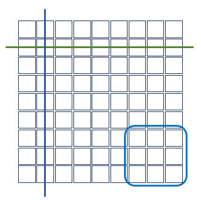

## 영지식증명 스도쿠  
Aviv Zohar - "The Incredible Machine"의 일부 번역  
[The Incredible Machine](https://medium.com/qed-it/the-incredible-machine-4d1270d7363a)  

앨리스가 밥에게 스도쿠 문제를 낸다. 그런데 밥은 도저히 답을 찾지 못한다. 결국 이 스도쿠는 답이 없다고 결론을 내린다. 하지만 앨리스는 답이 존재하는 스도쿠라고 주장한다. 앨리스는 밥에게 그것을 증명해 보이겠다고 한다. 밥은 답을 보고 답답했던 기분이 풀릴 것을 내심 기대한다. 그러나 앨리스는 답을 공개하지 않고 내가 답을 알고있음을 증명하겠다고 한다.  
 
앨리스는 답을 적은 81개의 카드를 뒤집어서 테이블 위에 9x9로 늘어놓는다. 미리 공개된 숫자는 그대로 노출시킨다. 그러니까 앨리스가 밥에게 낸 문제와 동일하다. 그러나 밥이 뒤집힌 카드를 열어서 확인하지 못하게 한다. 앨리스는 밥에게 행과 열 그리고 블록 중에 하나를 선택하라고 주문한다. 밥은 행을 선택한다. 앨리스는 각 행의 카드를 속이 보이지 않는 가방에 넣는다. 행 하나에 가방 하나가 필요하므로 9개 가방 안에 각 행의 카드 9장이 들어 있다. 앨리스는 가방을 흔들어서 안에 들어 있는 카드를 섞는다. 순서가 모두 섞이므로 가방을 열더라도 답을 알 수는 없게 된다.  

  
 
앨리스는 밥에게 이제 가방들을 열어보라고 말한다. 밥이 가방을 열어보니 모든 가방에는 각각 1부터 9까지 적힌 카드가 들어 있다. 앨리스는 이것이 자신이 답을 알고 있는 증거라고 주장한다.  
 
그러자 밥은 이것으로는 아무것도 증명하지 못한다고 소리친다. 답을 모르는 밥도 1부터 9까지 적힌 카드를 아무 순서대로 늘어놓을 수 있으니까 순서를 모두 공개하기 전까지는 믿을 수 없다고 말한다. 하지만 엘리스는 밥이 행을 선택할지 아니면 열을 선택할지 아니면 박스를 선택할지 모르기 때문에, 답을 알지 못한다면 각 가방에 1부터 9까지 숫자가 들어있을 수 없다고 말한다. 앨리스가 우연히 밥이 행을 선택할 것이라고 예측하고 그대로 될 가능성은 1/3이다.  
 
밥은 다시 해보자고 말한다. 이번에는 다른 것을 선택할 수도 있다. 원하는 만큼 이 과정을 반복하도록 해주자. 하지만 모두 각 가방에는 1부터 9까지 중복없이 적힌 카드가 들어 있다.  앨리스가 그야말로 터무니 없이 운이 좋지 않다면 한번 쯤은 중복된 숫자가 들어있는 가방이 발견될 텐데? 그렇지 않다면 앨리스는 정말 답을 알고 있을 가능성이 높다. 반면 밥은 스도쿠의 답을 알 방법이 전혀 없다.  
 
앨리스는 이 방법으로 스도쿠의 답을 공개하지 않고도 자신이 그 답을 알고 있음을 증명할 수 있다. 앨리스는 이런 과정을 유튜브로 중계하기로 한다. 그런데 어느 날 앨리스는 미처 답을 챙기지 못하고 유튜브 영상을 제작하게 된다. 그래서 밥과 말을 맞추기로 한다. 즉 행, 열, 박스 중에 어떤 것을 선택할지 미리 각본을 짜는 것이다. 당연히 유튜브 시청자들은 이들이 미리 정해진 각본대로 행동할 것이라는 사실을 알지 못한다.  
 
앨리스는 답을 모르는(또는 답이 존재하지 않는) 스도쿠지만 그냥 1부터 9까지 늘어놓기만 하면 된다. 밥은 약속(?)한 대로 행을 선택하든지 아니면 열을 선택하든지 하면 된다. 앨리스는 미리 정해진대로 거기에 9개의 숫자를 아무렇게나 배열해 놓았을 것이다. 그러나 유튜브를 시청하는 사람들은 앨리스와 밥의 공모를 알지 못하고 그 스도쿠의 답이 존재한다고 믿게 될 것이다.  
 
찰리는 이런 사실을 앨리스로부터 전해 듣고는 실망한다. 미리 짜놓은 각본대로 사람들을 속이는 것은 옳지 않은 일이다. 찰리는 앨리스와 밥이 신뢰할 수 없는 사람들이라고 생각하고 이것을 해결할 방법을 찾기로 한다. 찰리는 며칠동안 고심 끝에 "Zero-knowledge Sudoku Non-interactive Proof Machine(zk-SNIPM)"이라는 장치를 만든다. 이 장치는 앨리스가 하는 방법을 자동화시킨 것이다. 앨리스가 카드를 장치에 집어 넣고 스도쿠의 답을 입력하면 자동으로 가방에 행, 열 박스로 나누어 담는다. 앨리스가 가방을 열어본다. 이 과정은 모두 카메라가 켜진 상태에서 이루어지므로 조작할 수 없다. 그런데 장치가 어떤 순서(행, 열, 박스)로 가방에 카드를 넣을지는 미리 세팅을 한다. 당연히 앨리스와 밥은 알 수 없다. 찰리는 앨리스나 밥이 장치의 제어판에 접근하지 못하도록 철판으로 용접해버리고 그것도 모자라 각종 보안 장치를 부착시켰다. 이제 아무도 장치를 사전에 조작할 수는 없다.  
 
그런데 찰리만은 그 순서를 알고 있다. 그렇다면 찰리는 전에 앨리스와 밥이 공모한 것처럼 답이 없는 스도쿠 문제가 답이 있는 것처럼 조작할 수 있지 않을까? 물론 찰리는 자신이 그런 일을 할 사람이 아니라고 주장할 것이다.  앨리스는 찰리에게 한가지 제안을 한다. 소위 말하는 여러 사람이 참여하는 "trusted setup" 세레모니를 하자는 것이다. 이 과정은 다음과 같다. zk-SNIPM의 제어판을 열고(각종 보안 장치를 전부 제거한다) 앨리스, 밥, 찰리가 모두 장치의 세팅에 참여하는 것이다. 순서를 정하는 장치는 다이얼로 되어 있는데 세 가지(행, 열, 박스) 중 하나를 선택하도록 되어있다. 그러나 라벨을 지워서 어느 것을 선택했는지 알 수 없도록 한다. 단지 시계방향으로 1/3, 또는 2/3, 아니면 그대로 두는 식으로 세팅할 수 있도록 한다. 엘리스, 밥, 찰리는 차례로 장치가 있는 방으로 들어가서 다이얼을 돌린다. 설령 앨리스와 밥이 공모했다고 해도 찰리가 다시 다이얼을 돌리게 될 것이므로(또는 그대로 두거나) 어떤 순서로 세팅되는지 누구도 알 수 없다. 설령 두 사람이 공모했다고 해도 나머지 한 사람이 어떤 세팅을 하느냐에 따라 달라질 것이다. 세레모니가 끝나면 아무도 건드리지 못하게 철판으로 용접한다.  
 
zk-SNIPM은 "Non-interactive"를 가능하게 한 것이다. 이를 위해 trusted setup이라는 과정을 거쳐야만 한다. 그렇지 않으면 찰리에 의해(또는 찰리가 아닌 다른 사람이 찰리가 알고 있는 것을 훔칠 수 있다) 영지식증명의 보안이 깨질 수 있다. 여러 사람이 trusted setup에 참여하는 방식을 MPC(multiparty computation)라고 할 수 있다.  

[Home](../README.md)